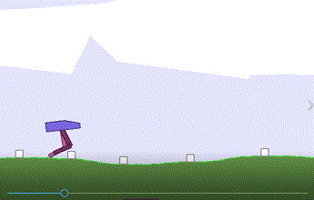
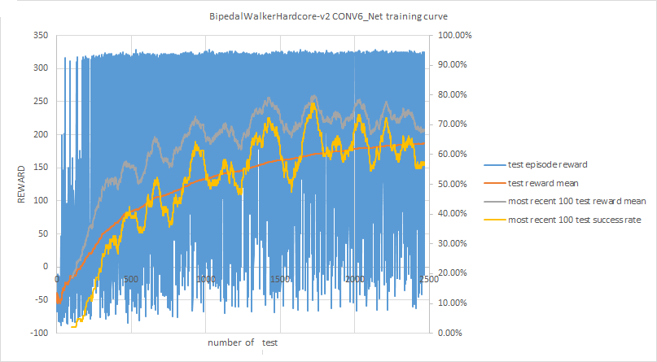

# OpenAI Gym BipedalWalker-v2

## 概要  

強化学習の[RL A3C Pytorch Continuous](https://github.com/dgriff777/a3c_continuous/)で、
OpenAI Gym のBipedalWalker-v2を解いたもの。  
このrepositoryの中に２足歩行するBipedalWalkerHardcore-v2の重みファイルが公開されているが、
BipedalWalker-v2は存在しないため、それを求めたもの。  
observationを使わないで高得点を上げている例や１本立ち歩行の例もあるが、
LSTMの有無含め、どのような歩き方になるかを見てみることにしたもの。  
2本足を交互に使って歩くと言う意味では、BipedalWalkerHardcoreのモデルをBipedalWalker用に再学習したものが、一番良かった。  
胴体動き、2本の足のそれぞれの動き、足の着地条件、そして、Lidar ライダー（奥行き距離検出器）を分離して入力し、順次合体していくモデルCONV3_Netを使えば、障害物の環境がなくても、２本足を交互に使って歩くことができた。   
更に、入力の特徴量として、加速度（前回と今回の速度の差）を追加したCONV4_NetとLidar(ライダー)用のCONVネットの出力にLSTMを追加したCONV6_Netを使って、BipedalWalkerHardcore-v2も挑戦してみた。更に、BipedalWalkerHardcoreと切り株が発生しやすいカスタム環境(BipedalWalkerStump1)の２つを混合して学習することによりポイントを向上させた。  


## 使い方  

オリジナルのa3c_continuousの説明文 README_a3c_continous.md を参照のこと。   
自動で終了しないので、画面のLOG出力を見ながら適当なところでctrl-Cキーで強制終了させる。  


オリジナルのa3c_continuousの設定のBipedalWalker-v2を学習する。　数時間ぐらいかけた。  
```
python main.py --workers 6 --env BipedalWalker-v2 --save-max True --model MLP --stack-frames 1
```

学習した重みファイルを使ってBipedalWalker-v2を動かす。  
```
python gym_eval.py --env BipedalWalker-v2 --num-episodes 100 --stack-frames 1 --model MLP --new-gym-eval True
```

学習した重みファイルを再ロードして、学習を続ける。  
```
python main.py --workers 6 --env BipedalWalker-v2 --load True --save-max True --model MLP --stack-frames 1
```


BipedalWalkerHardcore-v2の重みファイル(CONV1Dモデル, stack-frames 4)を使ってBipedalWalker-v2を動かす。  
trained_modelsの中のBipedalWalkerHardcore-v2.datをBipedalWalker-v2.datとして上書きしておくこと。  
```
python gym_eval.py --env BipedalWalker-v2 --num-episodes 100 --stack-frames 4 --model CONV --new-gym-eval True
```

BipedalWalkerHardcore-v2の重みファイル(CONV1Dモデル, stack-frames 4)を使ってBipedalWalker-v2を学習する。2時間半ぐらいかけた。  
trained_modelsの中のBipedalWalkerHardcore-v2.datをBipedalWalker-v2.datとして上書きしておくこと。  
```
python main.py --workers 6 --env BipedalWalker-v2 --load True --save-max True --model CONV --stack-frames 4
```


１つ前と現在の２つのobservationを使って学習する。  
```
python main.py --workers 6 --env BipedalWalker-v2 --save-max True --model MLP --stack-frames 2
```


Hardcoreの中でstump切り株だけのカスタム環境を使って学習する。  
```
python main.py --workers 6 --env BipedalWalkerStump1-v0 --save-max True --model MLP --stack-frames 1  --max-episode-length 4000
```


胴体動き、2本の足のそれぞれの動き、足の着地条件、そして、Lidar ライダー（奥行き距離検出器）を分離して入力し、順次合体していくモデルCONV3_Netを使ってBipedalWalker-v2を学習する。5時間ぐらいかけた。  
```
python main.py --workers 6 --env BipedalWalker-v2 --save-max True --save-last True --model CONV3 --stack-frames 4
```
引数のsave-lastは、最新の重みを xxx_last.datとして毎回保存するためのものである。引数save-maxだと、最大値(>0とき)のときのみ重みを保存する仕様になっている。  
  
  

加速度（前回と今回の速度の差）を追加したCON4_Netを使ったBipedalWalkerHardcore-v2の学習。  
BipedalWalker-v2環境で歩くことをはじめに学習させて(5時間ぐらいかけた)、その重みを初期値としてBipedalWalkerHardcoreを学習させる。  
```
python main.py --workers 6 --env BipedalWalker-v2 --save-max True --save-last True --model CONV4 --stack-frames 4

```
出来上がったtrained_modelsの中のBipedalWalker-v2.datをBipedalWalkerHardcore-v2.datとして上書きして、BipedalWalkerHardcore環境で学習する。24時間ぐらいかけた。  
```
python main.py --workers 24 --env BipedalWalkerHardcore-v2   --lr 0.00005 --load True  --save-max True  --save-last True --model CONV4 --stack-frames 4 --max-episode-length 4000
```
100回(num-episodes回)テストする。  
```
python gym_eval.py --env BipedalWalkerHardcore-v2 --num-episodes 100 --stack-frames 4 --model CONV4 --new-gym-eval True
```
  
  
BipedalWalkerHardcore-v2_CONV4_Net.datの重みデータを初期値(initweight)としてCONV5_Netを学習する。  
```
python main.py --workers 24 --env BipedalWalkerHardcore-v2   --lr 0.00005 --initweight True  --save-max True  --save-last True --model CONV5 --stack-frames 4 --max-episode-length 4000
```
学習過程でREWARD値が大きく蛇行して安定しない。試しに、ワーカーの数（マルチプロセスの数）を--workers 100に増やしてみた。  
多くのCPUが使える環境で、多くのワーカーを使うことで、学習時間の短縮（スピードアップ）することにアドバンテージがあるようだ。[参考文献5.5. Scalability and Data Efficiency](https://arxiv.org/abs/1602.01783)  


  
CONV6も、BipedalWalker-v2環境で歩くことをはじめに学習させて(数時間ぐらいかけた)、その重みを初期値としてBipedalWalkerHardcoreを学習させる。延べ50時間ぐらいかけた。  
```
python main.py --workers 24 --env BipedalWalkerHardcore-v2   --lr 0.00005 --load True  --save-max True  --save-last True --model CONV6 --stack-frames 4 --max-episode-length 4000
```
  


BipedalWalkerHardcore-v2のCONV6の重みを初期値として、2種類の環境 BipedalWalkerHardcoreとカスタム環境BipedalWalkerHardcoreStump1を混合して学習させる。21時間ぐらいかけた。  
```
python main2.py --workers 20 --workers2 4 --env BipedalWalkerHardcore-v2 --env2 BipedalWalkerHardcoreStump1-v0  --lr 0.00005 --load True  --save-max True  --save-last True --model CONV6 --stack-frames 4 --max-episode-length 4000
```

  
## 主な変更点  

- model.pyの中にLSTMのないMLPで学習する設定を追加。  
- test.py 更新した重みファイルを保存する時のメッセージstate_to_saveを追加。  
- shared_optim.py UserWarning: This overload of add_, addcmul_, addcdiv_の対策で引数の順番を変更。  
- custom_env  Hardcoreの中で、stump切り株だけ、pit落とし穴だけ、stairs階段だけ、のカスタム環境。  
- model.py 胴体動き、2本の足のそれぞれの動き、足の着地条件、そして、Lidar ライダー（奥行き距離検出器）を分離して入力し、順次合体していくモデルCONV3_Netを追加。CONV3_Netの入力に加速度（前回と今回の速度の差）を追加したCONV4_Net。Lidar用のCONVネットの出力にLSTMを追加したCONV6_Net。  
- main2.py 2種類の環境(BipedalWalkerHardcoreとカスタム環境のBipedalWalkerHardcoreStump1)を混合して学習するもの。  


## 動作環境  

現在のBipedalWalkerのバージョンは３であるが、古いバージョン２を使っている。  
CPUのみ。  

- python 3.6.4 on win32 (Windows 10)
- torch==1.7.1+cpu
- torchvision==0.8.2+cpu
- torchaudio==0.7.2
- numpy==1.18.4
- gym==0.15.3
- Box2d-py==2.3.8
- pyglet==1.2.1
- pyyaml==3.12
- setproctitle==1.2.1
- typing==3.7.4.3


また、Google colab上で実行するスクリプトを作ってみた。  
[BipedalWalker_v2_Colab.ipynb](https://colab.research.google.com/github/shun60s/BipedalWalker-a3c_continuous-clone/blob/master/BipedalWalker_v2_Colab.ipynb)  


### trained_models   

BipedalWalker-v2.dat　オリジナルの設定で学習した重みファイル  
BipedalWalker-v2_withoutLSTM.dat　LSTMのないMLPで学習した重みファイル  
BipedalWalker-v2_stackframe2.dat　stack_frame=2で学習した重みファイル  
BipedalWalkerHardcore-v2.dat　オリジナルのa3c_continuousからcloneした重みファイル  
BipedalWalker-v2_trained_using_Hardcore_dat.dat 上記のBipedalWalkerHardcoreのモデルを、更にBipedalWalker環境で学習させたもの。これが2本足を交互に使って走るという意味では、これが一番、良かった。  
  

BipedalWalkerStump1-v0.dat　stump切り株だけのカスタム環境を使って学習した重みファイル。 100回平均で182ポイント。  
  
2本足を交互に使って歩くには、環境（Hardcoreのstump切り株状の障害物のように1本歩行では超えるのが難しい環境）が揃わないといけないようだ。  


BipedalWalker-v2_CONV3_Net.dat　CONV3_Netで学習した重みファイル。障害物の環境がなくても、２本足を交互に使って歩くことができた。   
  
  
  
BipedalWalker-v2_CONV4_Net.dat　CONV4_NetはCONV3_Netの入力に加速度（前回と今回の速度の差）を追加したも。  
BipedalWalkerHardcore-v2_CONV4_Net.dat CONV4_Netを使ったBipedalWalkerHardcoreの重みファイル。100回平均で210ポイント。stump切り株状の障害物を超えられるか、超えても安定に着地できるかが問題になる。動作はなかなか安定しない。  
  
  
  
切り株状の障害物が発生する度合いを増やしたカスタム環境を使って、更に重みを学習させてみたが、改善にはつながらなかった。  
  
  
 
BipedalWalkerHardcore-v2_CONV5_Net.dat  CONV5_NetはCONV4_Netの入力にaction（前回の計算結果の出力）を追加したもの。CONV4_Netの方が結果はよかった。  
  
  
BipedalWalkerHardcore-v2_CONV6_Net.dat CONV6_NetはCONV4_NetのLidar(ライダー)用のCONVネットの出力にLSTMを追加したもの。  
100回平均の値は、ばらつき、だいたい240ポイント前後、ベストの値は261ポイント。  

  
  
  
  
BipedalWalkerHardcore-v2_CONV6_Net_mix_trained.dat CONV6_NetをBipedalWalkerHardcoreと切り株が発生しやすいカスタム環境(BipedalWalkerStump1)の２つを混合して学習することによりポイントを向上させたもの。299ポイント。  


BipedalWalker-v2_monitor_xxxの中に　歩き方の画像をmp4で格納した。  


## ライセンス  
Apache License 2.0  
オリジナルのa3c_continuousのライセンス文 LICENSE_ac3_continous.MD を参照のこと。   
カスタム環境についてはOpenAI gymのライセンス文 custom_env/LICENSE-OpenAI_gym.md を参照のこと。   

